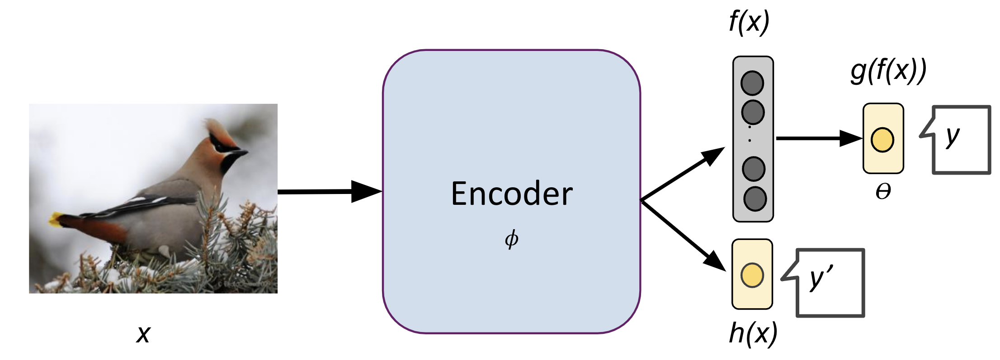
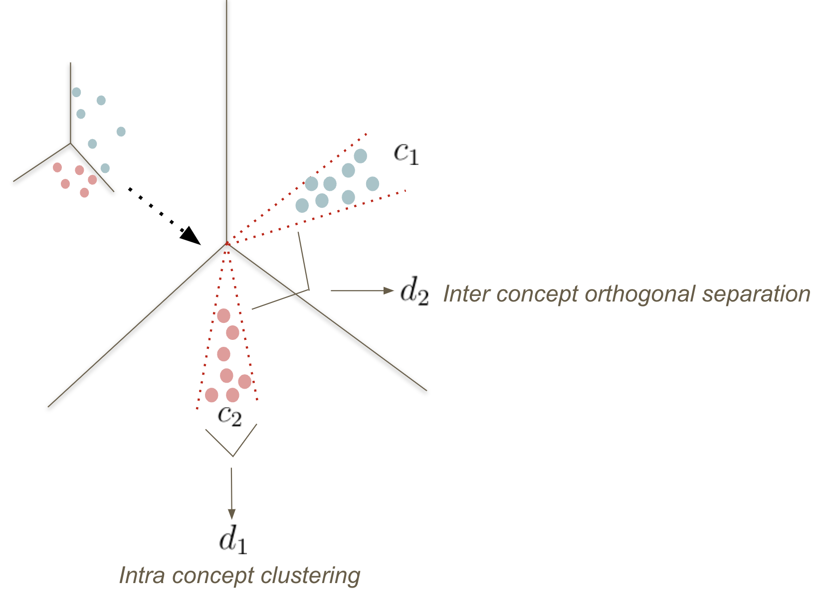

# coop-cbm
Repository for Neurips 2023 paper - Auxiliary Losses for Learning Generalizable Concept-based Model
该项目提出了一种新的概念瓶颈模型架构，通过辅助损失和概念正交损失（COL）来提高模型的泛化能力和概念表示质量。

详细代码目录结构与功能分析
1. 根目录文件
README.md: 项目说明文档，包含论文信息、使用方法和引用信息
experiments.py: 主实验入口文件，支持多种实验模式：
Concept_XtoC: 概念预测实验
Independent_CtoY: 独立的概念到类别预测
Sequential_CtoY: 序列化概念到类别预测
Joint: 联合训练
Standard: 标准模型训练
Coop: Coop-CBM模型训练
Probe: 探针实验
TTI: 测试时干预
Robustness: 鲁棒性测试
analysis.py: 分析工具模块，包含性能评估、可视化和统计分析功能
2. src/ 核心源码目录
2.1 src/model/ 模型定义模块
models.py: 定义了所有模型架构的工厂函数：

ModelXtoC: X→C 概念预测模型
ModelOracleCtoY: 使用真实概念的C→Y模型
ModelXtoCtoY: 端到端X→C→Y模型
ModelXtoY: 标准分类模型
ModelXtoCY: Coop-CBM模型（核心贡献）
template_model.py: 核心模型架构实现：

Inception3: 修改的InceptionV3网络
End2EndModel: 端到端模型包装器
End2EndModelCoop: Coop-CBM模型包装器
MLP: 多层感知机
FC: 扩展的全连接层
probe.py: 线性探针实验，用于评估学习到的表示质量

hyperopt.py: 超参数优化模块

2.2 src/data/ 数据处理模块
dataloader.py: 数据加载器实现，支持多个数据集：

DatasetBirds: CUB-200-2011鸟类数据集
OODBird: 分布外鸟类数据集
ColoredMNIST: 彩色MNIST数据集
CelebA: CelebA人脸数据集
DatasetAnimals: 动物数据集
TIL, Nec: 医学图像数据集
data_sel.py: 数据选择和预处理工具

gen_spurious.py: 生成虚假相关性数据集，用于鲁棒性测试

old_dataset.py: 旧版数据集处理（未完全展示）

2.3 src/util/ 工具函数模块
utils.py: 通用工具函数：

参数解析
随机种子设置
类别和属性名称获取
图像显示功能
config.py: 配置常量：

N_ATTRIBUTES = 312: 属性数量
N_CLASSES = 200: 类别数量
学习率衰减参数
train_util.py: 训练工具函数：

run_epoch: 标准训练循环
run_epoch_simple: 简化训练循环（仅属性预测）
inference.py: 推理和评估工具，支持多种评估模式

2.4 src/eval/ 评估模块
tti.py: 测试时干预（Test-Time Intervention）实验，用于评估概念的可解释性和干预效果
2.5 核心创新模块
src/col.py: **概念正交损失（Concept Orthogonal Loss）**实现：

class ConceptOrthogonalLoss(nn.Module):
    def __init__(self, gamma=0.5):
        # 促进同类概念相似，异类概念正交
src/train.py: 主训练模块，实现了所有训练函数：

支持多种损失函数组合
集成COL损失
早停机制
模型保存和恢复
3. src/imgs/ 图像资源
coop.png: Coop-CBM架构图
col.png: 概念正交损失示意图
核心技术创新
1. Coop-CBM架构
协作式概念瓶颈模型：同时进行概念预测和类别预测，通过辅助损失连接两个任务
多任务学习：概念预测作为辅助任务帮助主分类任务
2. 概念正交损失（COL）
目标：使同类样本的概念表示相似，不同类样本的概念表示正交
实现：通过特征归一化和余弦相似度计算实现概念解耦
3. 支持的实验类型
概念预测：X→C
独立训练：分别训练X→C和C→Y
序列训练：先训练X→C，再训练C→Y
联合训练：端到端训练X→C→Y
Coop训练：协作式多任务训练
测试时干预：评估概念的可解释性
数据集支持
CUB-200-2011: 主要数据集，200类鸟类，312个属性
分布外测试: 支持多种分布偏移测试
合成数据: 支持生成虚假相关性数据
使用方式
python experiments.py CUB Coop -log_dir Coop/outputs/ -e 1000 -optimizer sgd -pretrained -use_aux -use_attr -n_attributes 312 -attr_loss_weight 1.0 -normalize_loss -b 64 -weight_decay 0.0004 -lr 0.01 -scheduler_step 20 -dset birds -data_dir /path/to/data
这个项目是一个完整的概念瓶颈模型研究框架，不仅实现了新的Coop-CBM架构，还提供了全面的实验评估工具，支持多种数据集和评估指标，是概念可解释性机器学习领域的重要贡献。


# Auxiliary Losses for Learning Generalizable Concept-based Model

This repo provides code for our Neurips 2023 paper - Auxiliary Losses for Learning Generalizable Concept-based Model. 

[Ivaxi Sheth](https://ivaxi0s.github.io/), [Samira Ebrahimi Kahou](https://saebrahimi.github.io/)

**Motivation**

While CBMs present benefits with models’ explainability, some works have shown that concept representations of CBM may result in information leakage that deteriorates predictive performance. It is also noted that CBM may not lead to semantically explainable concep. Such
bottlenecks may result in ineffective predictions that could prevent the use of CBMs in the wild.


**Coop-CBM + Concept Orthogonal Loss**

In this work, we propose cooperative-CBM (coop-CBM) model aimed at addressing the performance
gap between CBMs and standard black-box models. Coop-CBM uses an auxiliary loss that facilitates
the learning of a rich and expressive concept representation for downstream task. To obtain orthogonal
and disentangled concept representation, we also propose concept orthogonal loss (COL). COL can
be applied during training for any concept-based model to improve their concept accuracy. 
We perform an extensive evaluation of the generalisation capabilities of CBMs on three
different distribution shifts.





**Usage**

In comparision to many CBM works, we all all of the concepts for CUB. To run the models for coop-CBM with COL, run the following command:

```
python experiments.py Coop -log_dir Coop/outputs/ -e 1000 -optimizer sgd -pretrained -use_aux -use_attr -n_attributes $N_ATTR -attr_loss_weight $ATTR_W -normalize_loss -b 64 -weight_decay $WD -lr $LR -scheduler_step 20 -dset $DATASET -data_dir $DATA_DIR
 ```

The synthetic dataset generation can be found in `src.data.gen_spurious`.

### Argument Parsing

The `parse_arguments` from `src.util.utils` function is designed to handle different experiment configurations. 

## Citation

If you find our work useful in your research, please consider citing:

```bibtex
@inproceedings{
sheth2023auxiliary,
title={Auxiliary Losses for Learning Generalizable Concept-based Models},
author={Ivaxi Sheth and Samira Ebrahimi Kahou},
booktitle={Thirty-seventh Conference on Neural Information Processing Systems},
year={2023},
url={https://openreview.net/forum?id=jvYXln6Gzn}
}
```